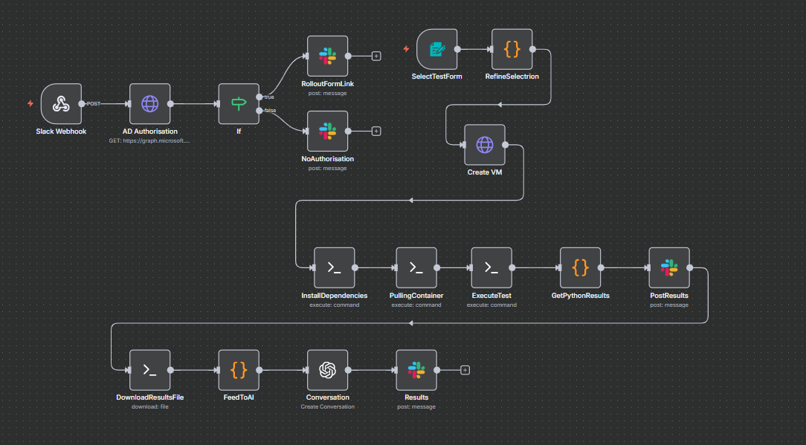

# My n8n JMeter Workflow

Here’s the workflow diagram:

Postman Mock server currently being tested
https://c1e4cf32-660e-4610-a2c4-c672d1b03bf4.mock.pstmn.io

Request:
POST https://c1e4cf32-660e-4610-a2c4-c672d1b03bf4.mock.pstmn.io/run-test
Content-Type: application/json
{
  "test_type": "stress",
  "duration": "60s"
}

Expected Response:
{
  "message": "Test started successfully",
  "test_id": "12345",
  "status": "queued"
}

**Components:**

1. **Slack Trigger**  
   - Users trigger tests using `/runtest` or buttons.  
   - Collects test parameters (test type, duration, environment).

2. **Form Submission (Optional)**  
   - Allows users to provide multiple parameters via a form.  

3. **Azure VM / SSH Node**  
   - Creates or connects to a VM.  
   - Installs Docker (if needed).  
   - Pulls a prebuilt JMeter container.  
   - Runs the JMeter test with dynamic parameters.

4. **JMeter Test Result Handling**  
   - Downloads `.jtl` results from VM.  
   - Processes results using a **Code node / Python script** into JSON.

5. **OpenAI Conversation Node**  
   - Users can ask questions about test results.  
   - AI provides summaries, metrics insights, or explanations.

6. **Slack Response**  
   - AI-generated insights are sent back to the user in Slack.

